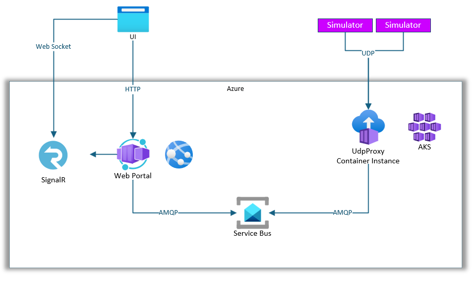
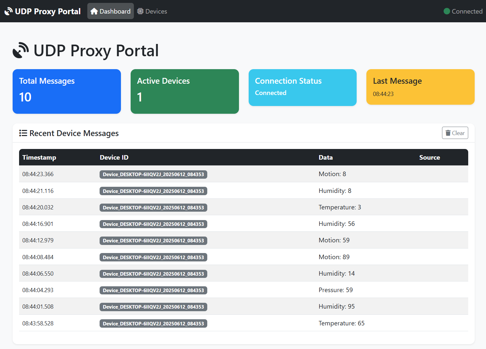

# UDP Proxy Demo Solution

A comprehensive demonstration of real-time device telemetry processing using UDP communication, Azure Service Bus messaging, and web-based monitoring portal with SignalR.

## 🏗️ Architecture Overview



```
UDP Devices → UDP Proxy Server → Azure Service Bus → Web Portal → Real-time Dashboard
```

### Components

1. **UDP Proxy Server** - Receives UDP messages from devices and forwards to Azure Service Bus
2. **UDP Client Simulator** - Simulates IoT devices sending telemetry data
3. **Web Portal** - Real-time monitoring dashboard with Blazor WebAssembly and SignalR
4. **Azure Service Bus** - Message queue for reliable message processing
5. **Azure SignalR** - Real-time web communication for live updates

## 📦 Projects Structure

### UdpProxy.Server
- **Technology**: .NET 8.0 Console Application
- **Purpose**: UDP server that receives device messages and forwards to Azure Service Bus
- **Key Features**:
  - Listens on UDP port 8080
  - Processes JSON device messages
  - Forwards messages to Azure Service Bus queue
  - Message statistics monitoring
  - Docker containerization support

### UdpProxy.Client
- **Technology**: .NET 8.0 Console Application  
- **Purpose**: Simulates IoT devices sending telemetry data
- **Key Features**:
  - Generates unique device IDs
  - Sends single messages, continuous simulation, or test batches
  - Configurable server endpoint
  - Random sensor data generation

### UdpProxy.Portal
- **Technology**: Blazor WebAssembly + ASP.NET Core 8.0
- **Purpose**: Real-time web dashboard for monitoring device messages
- **Key Features**:
  - Real-time message display with SignalR
  - Device statistics and analytics
  - Active device monitoring
  - Message history and filtering
  - Bootstrap responsive UI
  - Azure SignalR Service integration

## 🚀 Quick Start

### Prerequisites
- .NET 8.0 SDK
- Azure Service Bus namespace with queue
- Azure SignalR Service (optional, for scale)
- Docker (optional, for containerization)

### 1. Configure Azure Services

#### Azure Service Bus Setup
```json
{
  "ServiceBusConnectionString": "Endpoint=sb://your-namespace.servicebus.windows.net/;SharedAccessKeyName=RootManageSharedAccessKey;SharedAccessKey=your-key",
  "ServiceBusQueueName": "telemetry"
}
```

#### Azure SignalR Setup (Optional)
```json
{
  "ConnectionStrings": {
    "AzureSignalR": "Endpoint=https://your-signalr.service.signalr.net;AccessKey=your-key;Version=1.0;"
  }
}
```

### 2. Run the Solution

#### Start UDP Server
```bash
cd UdpProxy.Server
dotnet run
```
Server will listen on UDP port 8080 and forward messages to Azure Service Bus.

#### Start Web Portal
```bash
cd UdpProxy.Portal/UdpProxy.Portal
dotnet run
```
Portal available at: https://localhost:7060

#### Run Device Simulator
```bash
cd UdpProxy.Client
dotnet run
```
Choose from menu options to simulate device messages.

## 🔧 Configuration

### UDP Server Configuration
Update `appsettings.json` in UdpProxy.Server:
```json
{
  "ServiceBusConnectionString": "your-service-bus-connection-string",
  "ServiceBusQueueName": "your-queue-name"
}
```

### Portal Configuration  
Update `appsettings.json` in UdpProxy.Portal:
```json
{
  "ServiceBusConnectionString": "your-service-bus-connection-string",
  "ServiceBusQueueName": "your-queue-name",
  "ConnectionStrings": {
    "AzureSignalR": "your-signalr-connection-string"
  }
}
```

### Client Configuration
Modify `SERVER_HOST` in UdpProxy.Client Program.cs:
```csharp
const string SERVER_HOST = "your-server-ip-or-hostname";
```

## 🐳 Docker Support

### Build UDP Server Container
```bash
cd UdpProxy.Server
docker build -t udp-proxy-server .
docker run -p 8080:8080/udp udp-proxy-server
```

### Build Portal Container
```bash
cd UdpProxy.Portal
docker build -t udp-proxy-portal .
docker run -p 8080:8080 udp-proxy-portal
```

## 📊 Features



### Real-time Dashboard
- **Total Messages**: Count of all processed messages
- **Active Devices**: Devices active in last 5 minutes  
- **Connection Status**: SignalR connection monitoring
- **Message Rate**: Messages per minute statistics

### Device Management
- Device listing with activity status
- Message count per device
- Last seen timestamps
- Filter active/inactive devices
- Device-specific message viewing

### Message Processing
- JSON message serialization/deserialization
- Message validation and error handling
- Reliable delivery via Azure Service Bus
- Real-time web broadcasting via SignalR

## 🔄 Message Flow

1. **Device Client** sends JSON message via UDP
2. **UDP Server** receives message, validates, and forwards to Service Bus
3. **Service Bus** queues message for reliable processing
4. **Portal Background Service** reads from Service Bus
5. **SignalR Hub** broadcasts message to connected web clients
6. **Web UI** displays message in real-time dashboard

### Message Format
```json
{
  "DeviceId": "Device_MachineName_20250612_143022",
  "Timestamp": "2025-06-12T14:30:22.123Z",
  "Data": "Temperature: 25.6°C",
  "SourceEndPoint": "192.168.1.100:12345"
}
```

## 🛠️ Development

### Build Solution
```bash
dotnet build UdpProxy.Server.sln
```

### Run Tests
```bash
dotnet test
```

### Publish for Production
```bash
dotnet publish -c Release
```

## 🚀 Deployment

### GitHub Actions CI/CD
The solution includes automated build and deployment workflows:
- `build-deploy.yml` - Builds and deploys UDP Server container
- `build-deploy-webapp.yml` - Builds and deploys Portal container

### Azure Container Instances
Both components can be deployed to Azure Container Instances with environment variables for configuration.

### Azure App Service
The Portal can be deployed to Azure App Service with container deployment.

## 🔍 Monitoring & Troubleshooting

### Logs
- UDP Server: Console output with message statistics
- Portal: ASP.NET Core logs with Service Bus processing
- Azure Service Bus: Dead letter queues for failed messages

### Common Issues
1. **UDP Port Binding**: Ensure port 8080 is available
2. **Service Bus Connection**: Verify connection strings and permissions
3. **SignalR Connection**: Check CORS configuration for cross-domain access
4. **Message Format**: Ensure JSON serialization compatibility

## 📄 License

MIT License - see [LICENSE](LICENSE) file for details.

## 🤝 Contributing

1. Fork the repository
2. Create feature branch
3. Make changes with tests
4. Submit pull request

## 📚 Additional Resources

- [Azure Service Bus Documentation](https://docs.microsoft.com/azure/service-bus/)
- [Azure SignalR Service Documentation](https://docs.microsoft.com/azure/azure-signalr/)
- [Blazor WebAssembly Documentation](https://docs.microsoft.com/aspnet/core/blazor/)
- [.NET 8.0 Documentation](https://docs.microsoft.com/dotnet/)